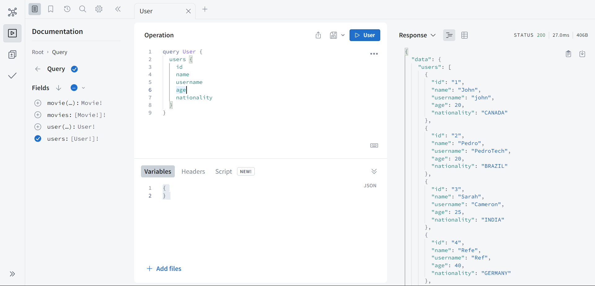

# GraphQL Server with Apollo Server in Typescript

This is a GraphQL server built using Apollo Server and TypeScript. It provides a flexible and easy-to-use API for your front-end applications.

## **Prerequisites**
Before you get started, make sure you have the following software installed on your machine:

- [Node.js](https://nodejs.org/) (v14 or higher)  
- [npm](https://www.npmjs.com/) or [Yarn](https://yarnpkg.com/) package manager

## **Getting Started**
To get started with this server, follow these steps:

1. Clone this repository to your local machine:
    ```bash
    git clone https://github.com/subrotokumar/graphql-api-nodejs.git
    ```  

2. Install the necessary dependencies using your package manager of choice:
    ```bash
    # Using npm
    npm install

    # Using Yarn
    yarn
    ```

3. Start the server using the following command:
    ```bash
    # Using npm
    npm run dev

    # Using Yarn
    yarn dev
    ```

4. Once the server is running, you can access the GraphQL playground at [http://localhost:4000/](http://localhost:4000/)
   
    

## **Project Structure**

Here's a high-level overview of the project structure:

```
[PROJECT]
├── src/
│   ├── index.ts            # Entry point of the application.
│   └── schema/        
│       ├── type-def.ts     # Contains the resolver functions for the GraphQL schema.
│       └── resolvers.ts    # Contains the data models used by the resolvers.
├── .gitignore              # Git ignore file.
├── package.json            # NPM package file.
├── README.md               # This file.
└── tsconfig.json           # TypeScript configuration file.
```

- **src/index.ts**: Entry point of the application. Initializes Apollo Server and sets up the GraphQL schema.
- **src/schema/type-def.ts**: Defines the GraphQL schema using the graphql-tools library. You can modify this file to add or remove GraphQL types, queries, and mutations.
- **src/schema/resolvers.ts**: Contains the resolver functions for the GraphQL schema. You can modify these files to add or remove resolver functions for your GraphQL API.
<!-- - **src/models/**: Contains the data models used by the resolvers. You can modify these files to add or remove data models for your GraphQL API.
tests/: Contains the tests for the server. You can modify these files to add or remove tests for your GraphQL API. -->
<!-- - **.env.example**: Example environment variables file. Copy this file to .env and modify it to suit your needs.
- **.eslintrc.json**: ESLint configuration file. You can modify this file to change the ESLint rules for your codebase. -->
- **.gitignore**: Git ignore file. You can modify this file to exclude certain files and directories from Git.
- **package.json**: NPM package file. You can modify this file to add or remove dependencies for your server.
- **README.md**: This file. You can modify this file to provide more detailed instructions for your server.
- **tsconfig.json**: TypeScript configuration file. You can modify this file to change the TypeScript compiler options for your codebase.

## **Contributing**
Contributions are welcome! Feel free to open an issue or submit a pull request.

## **License**
This project is licensed under the `MIT` License. See the LICENSE file for more information.